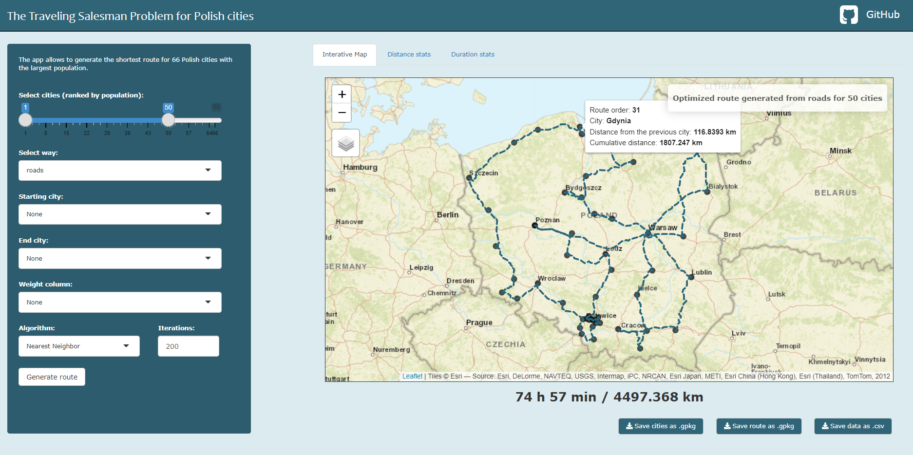
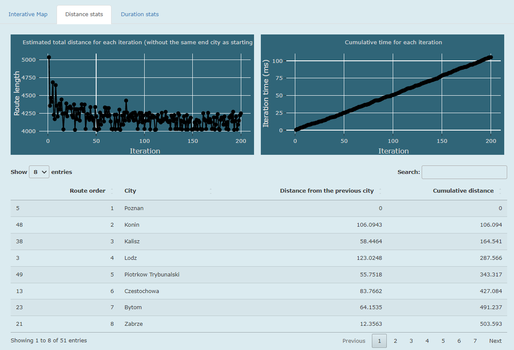

# shinyxcensus
### *Traveling Salesman Problem (TSP) for polish cities*
https://adryanqe.shinyapps.io/TravelingSalesmanR/
<br />


## About

<br />

The app allows to generate the shortest route for 66 Polish cities with the largest population.

## Features

* **Interactive map showing cities and the most optimal route, based on selected parameters**



<br />

* **Stats and output data**



<br />

## Setup

```
install.packages(c("shiny", "dplyr", "sf", "leaflet", "tidyverse", "geosphere", "TSP", "htmltools",
                   "leaflet.providers", "DT", "shinyjs", "htmlwidgets", "ggplot2", "plotly"))
                   
library(shiny)
runGitHub("TravelingSalesmanR", "Adrian-Nowacki", subdir = "app/", ref = "main")
```

